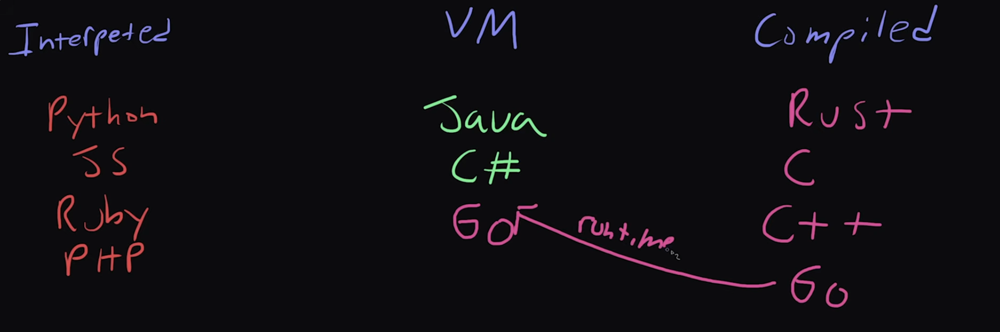

## GO vs others
- Pretty much any interpreted language, language that is not compiled is going to be slower than go, because go is a compiled language 
- interpreted languages : javascript, python, Ruby, PHP
- compiled languages : Rust, C, C++
- In terms of compilation speed go is much faster than these languages. GO doesn't necessarily runs faster than these compiled languages, 
but it does beat them when compiling

- Natively compiled languages : Rust , C, C++, GO
- VM : java, C#
- Natively compiled languages means languages which are directly compiled to machine code that runs on CPU

- VM languages means compiled languages that run top of virtual machines

- Even though GO is a Natively compiled language like Rust, C, C++ but its execution speed is more similar to Java, C#(How  many computations it can do per second). The primary reason for that is go runtime. There is basically a chunk of code that is included in every go program that manages memory and that tends to slow down the execution speed. It needs to be pointed out that Go program tends to use much less memory than java and C#. Because there isn't a need to for entire virtual machine 

